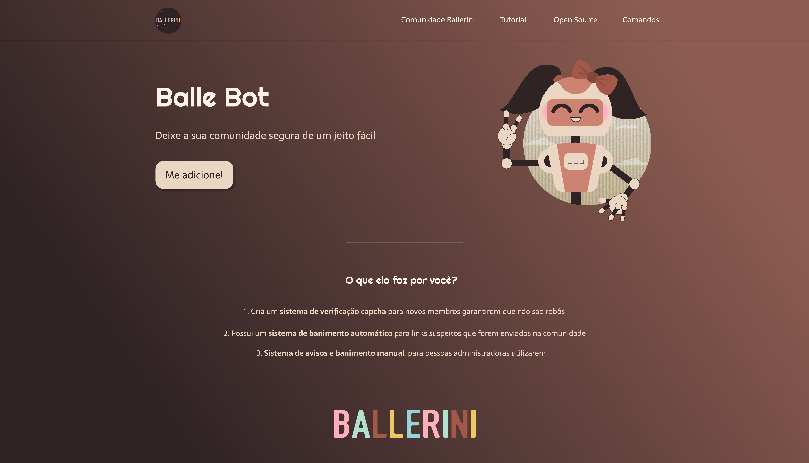

<!-- PROJECT LOGO -->
<div id="readme-top" align="center">
<div >

</div>

<h1 align="center">
    Landing Page - Ballerini
</h1>
<p align="center">
    A landing page with a very attractive design
    <br />
</p>

<p align="center">
<a href="#about-the-project">About The Project</a>
&nbsp;&nbsp;&nbsp;&nbsp;|&nbsp;&nbsp;&nbsp;
<a href="#built-with">Built With</a>&nbsp;&nbsp;&nbsp;&nbsp;|&nbsp;&nbsp;&nbsp;
<a href="#getting-started">Getting Started</a>&nbsp;&nbsp;&nbsp;&nbsp;|&nbsp;&nbsp;&nbsp;
 <a href="#usage">Usage</a>&nbsp;&nbsp;&nbsp;&nbsp;|&nbsp;&nbsp;&nbsp;
 <a href="#project-tree">Project Tree</a>&nbsp;&nbsp;&nbsp;&nbsp;|&nbsp;&nbsp;&nbsp;
 <a href="#usage">Acknowledgments</a>&nbsp;&nbsp;&nbsp;&nbsp;
</p>

<p align="center">
</img>
</p>
</div>

<!-- ABOUT THE PROJECT -->

## About The Project

[![Product Name Screen Shot][product-screenshot]](https://example.com)

This was my first development of a landing page. I highly recommend this project for beginners developers, as it works well with html and css. Differentials:

- Semantic html
- Gradient background
- Differentiated hover effect on links and button CTA
- Exclusive design by rafaela ballerini
- Very attractive color palette :D
- Deploy on aws

<p align="right"><a href="#readme-top">back to top</a></p>

<!-- BUILT WITH -->

## Built With

This section should list any major frameworks/libraries used in project. 

- 
- 

<p align="right"><a href="#readme-top">back to top</a></p>

<!-- GETTING STARTED -->

## Getting Started

These instructions provide a clear and simple step-by-step, which is intended to help users understand accessing and configuring.

1. Clone the repo
   ```sh
   git clone https://github.com/cristianmeelo/landing-page-ballerini
   ```
2. Install extension live server in vscode</br>


3. Run the project by clicking on `Go Live` in the lower right corner <br/>


<p align="right"><a href="#readme-top">back to top</a></p>

<!-- USAGE EXAMPLES -->

## Usage

A landing page is a website page created specifically to receive and convert visitors into leads, customers or other desired actions. It is usually created with a specific objective, such as increasing sales of a product, capturing contact information from potential customers or encouraging the download of an e-book, for example.

The landing page is designed to provide relevant and straightforward information about what the visitor is looking for and encourage them to take a specific action, such as filling out a form, making a purchase or subscribing to a mailing list. It can be used in online advertising campaigns, such as ads on Google or social media, or in other digital marketing strategies. </br>
` - chat GPT`

<div align="center">
<a href="http://cristianmeelo.com.s3-website-sa-east-1.amazonaws.com/">

</div>

<div align="center">

</div>
</br>

<p align="right"><a href="#readme-top">back to top</a></p>

<!-- PROJECT  Tree -->

## Project Tree

```
LandingPage-Ballerini
├─ README.md
├─ assets
│  ├─ BalleBot_page-0001.jpg
│  ├─ ballebot.svg
│  ├─ ballerini_footer_image.svg
│  └─ logo.svg
├─ index.html
└─ style.css


```

<p align="right"><a href="#readme-top">back to top</a></p>

<!-- ACKNOWLEDGMENTS -->

## Acknowledgments
This space list helpful resources and credits.


- [Figma Design][figma-link]
- [Stackblitz Code][stackblitz-link]
- [Video Tutorial][tutorial-video]
- [Github Ballerini][partner-github]

This space list helpful resources and credits.


<p align="right"><a href="#readme-top">back to top</a></p>

<p align="center">
.
<br/>
.
<br/>
.
<br/>
.
<br/>
<br/>
with ❤️
<a href="https://www.linkedin.com/in/cristian-melo/">
 Cristian Melo
</a>
</p>
</div>


<!-- MARKDOWN LINKS & IMAGES -->
<!-- https://www.markdownguide.org/basic-syntax/#reference-style-links -->

[product-screenshot]: https://images.unsplash.com/photo-1536560942313-1530f4653ac3?ixlib=rb-4.0.3&ixid=MnwxMjA3fDB8MHxwaG90by1wYWdlfHx8fGVufDB8fHx8&auto=format&fit=crop&w=1548&q=80

[figma-link]: https://www.figma.com/file/myqP66iQwzjwjrIAJyyrip/BalleBot?node-id=0%3A1&t=xaxOj9U8380vQL7r-0

[stackblitz-link]: https://stackblitz.com/edit/web-platform-fljbsg?file=index.html,styles.css

[tutorial-video]: https://www.youtube.com/watch?v=llF6vD-RljE&t=138s&ab_channel=RafaellaBallerini

[partner-github]: https://github.com/rafaballerini

<!-- SHIELDS -->
[HTML5]:https://img.shields.io/badge/HTML5-E34F26?style=for-the-badge&logo=html5&logoColor=white
[CSS3]: https://img.shields.io/badge/css3-%231572B6.svg?style=for-the-badge&logo=css3&logoColor=white
[SASS]:https://img.shields.io/badge/Sass-CC6699?style=for-the-badge&logo=sass&logoColor=white
[next.js]: https://img.shields.io/badge/next.js-000000?style=for-the-badge&logo=nextdotjs&logoColor=white
[react.js]: https://img.shields.io/badge/React-20232A?style=for-the-badge&logo=react&logoColor=61DAFB
[vue.js]: https://img.shields.io/badge/Vue.js-35495E?style=for-the-badge&logo=vuedotjs&logoColor=4FC08D
[angular.io]: https://img.shields.io/badge/Angular-DD0031?style=for-the-badge&logo=angular&logoColor=white
[svelte.dev]: https://img.shields.io/badge/Svelte-4A4A55?style=for-the-badge&logo=svelte&logoColor=FF3E00
[bootstrap.com]: https://img.shields.io/badge/Bootstrap-563D7C?style=for-the-badge&logo=bootstrap&logoColor=white
[jquery.com]: https://img.shields.io/badge/jQuery-0769AD?style=for-the-badge&logo=jquery&logoColor=white

<!-- URL`S -->
[next-url]: https://nextjs.org/
[react-url]: https://reactjs.org/
[vue-url]: https://vuejs.org/
[angular-url]: https://angular.io/
[bootstrap-url]: https://getbootstrap.com
[jquery-url]: https://jquery.com
[svelte-url]: https://svelte.dev/